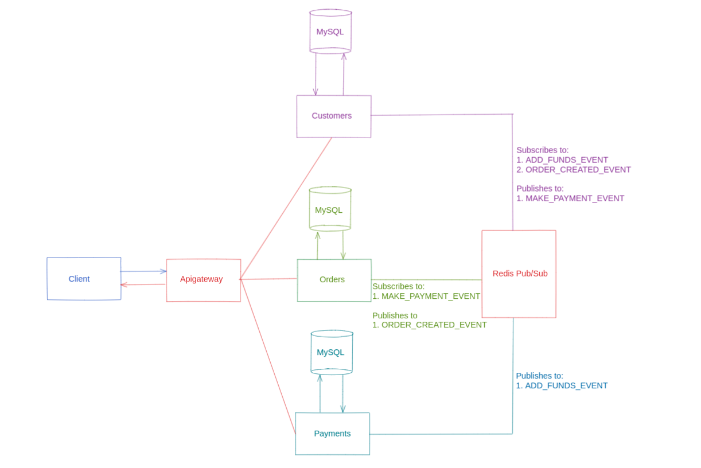

<!-- omit in toc -->
# Distributed Transaction

<!-- omit in toc -->
## Table of Contents
- [Purpose](#purpose)
- [Components](#components)
	- [Client](#client)
	- [API Gateway](#api-gateway)
	- [gRPC Services](#grpc-services)
	- [Redis Pub/Sub](#redis-pubsub)
- [Features & Design](#features--design)

## Purpose
- The purpose of this project was to build a working example of handling a transaction that occurs across multiple microservices with individual databases.

## Components

### Client
- The client communicates with the gRPC services via the `apigateway` component

### API Gateway
- The API Gateway component is the bridge between the frontend client and the distributed backend
- It utilizes the [gRPC-Gateway](https://github.com/grpc-ecosystem/grpc-gateway) as a reverse proxy

### gRPC Services
- The backend system consists of three gRPC services, each of which are connected to their own MySQL databases
  1. Customers
  2. Orders
  3. Payments

### Redis Pub/Sub
- Asynchronous communication between backend services is handled with Redis pub/sub channels

## Features & Design
- The application consists of a frontend user interface that communicates with a distributed backend system.
- A customer can create and account, and order items.
- The customer must have enough funds in their `wallet` to place an order.
- When a request to place an order is made, the customer receives a response when the record is added the the Orders database, but whether the order is successful depends on the amount of funds available in customer's `wallet`.
- To track the status of the order, another connection is opened between the client and the API Gateway where Server-Sent Events (SSE) are streamed to the client for updates on the order.
- When the order fails due to insufficient funds in the customer's `wallet`, a message is published to the Redis broker from the Customers service that an error occurred, and the
Orders service removes the record from its database.
- When the order is successful, the Customers service publishes a successful message to the same channel, and the Orders service updates the record's `status` value from `pending` to `paid`.
- The outcome of this distributed transaction determines which event is sent to the client.
- A customer can add funds to their wallet via the Payments service, where they can add a credit card (a fake one) and use it to add to the value of `wallet` in the Customers databases for that customer.
- Communication between the Payments service and Customers service is also handled asynchronously via the Redis broker.

